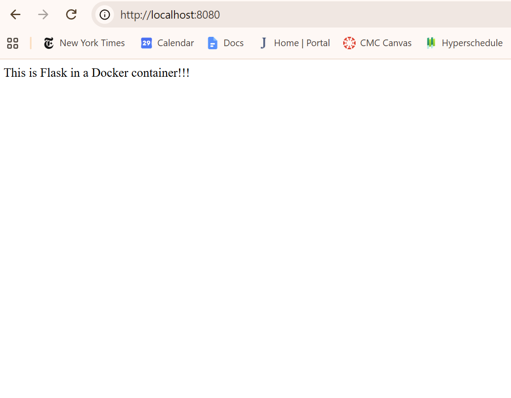

# Docker and Flask Application

This repo contains a Flask web application running inside a Docker container.

To run the web application, run
```docker build -t flask-tutorial .```,
then
```docker run -d -p HOST_PORT:5000 flask-tutorial```.


